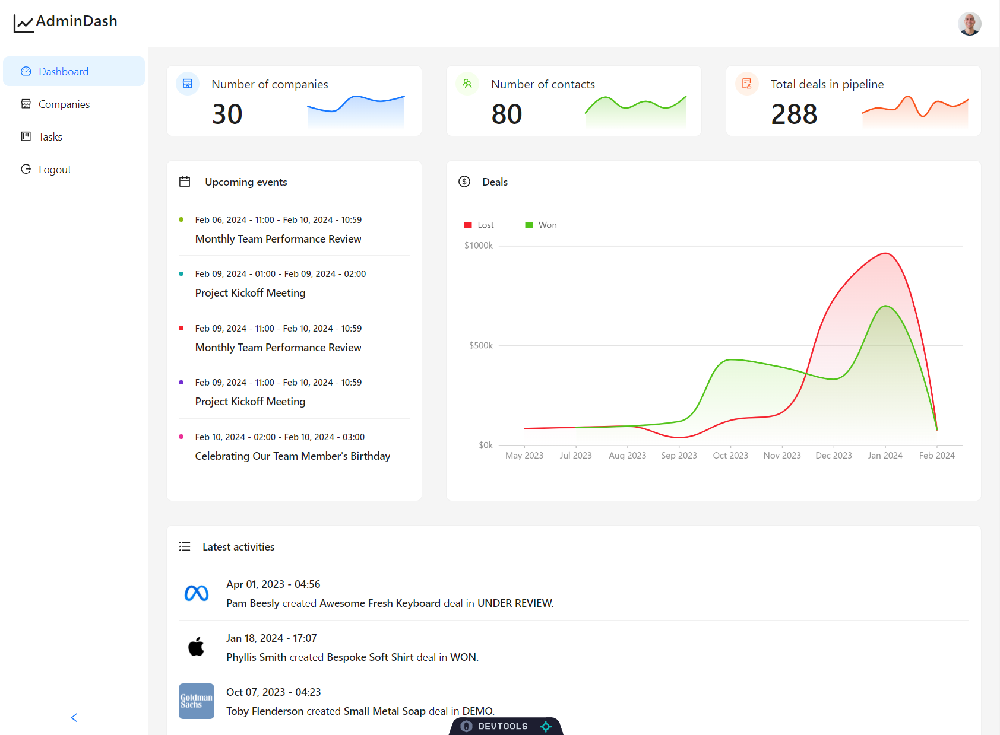

# AdminDash 

AdminDashboard is a comprehensive admin panel and dashboard application built with the Refine framework. It leverages the power of React for building flexible and efficient user interfaces, providing a solid foundation for internal tools, admin panels, dashboards, and B2B applications.

You can explore the deployed version of AdminDashboard here:

https://admin-dash-sb2t.vercel.app/

## What I Learned

- Utilizing the Refine framework for rapid development of admin panels.
- Implementing authentication and access control with industry-standard solutions.
- Simplifying state management, routing, and networking in React applications.
- Integrating Ant Design for a polished UI experience.
- Leveraging GraphQL for efficient data fetching and manipulation.
- Deploying a full-stack application on Vercel.

## Technologies Used

- Frontend: React, TypeScript, Ant Design, @refinedev/core, GraphQL.
- Backend: Node.js, Express.js (assumed for API interactions).
- Database: (Assumed MongoDB or similar based on GraphQL usage).
- Deployment: Vercel.

## How to run AdminDash

### Prerequisites

- npm

### Installation

1. Clone the repository:

   `git clone https://github.com/Tim-Mclennan/AdminDash`

2. Install NPM packages:

    `npm install`

### Running the Application

### Development Server

`npm run dev`

### Production Build

`npm run build`

The client runs on port 5000 by default, but this can be configured by setting the PORT environment variable in a .env file.

## Project Structure

The project is structured around the Refine framework's best practices, with the 'src' directory containing the main application code, including pages, components, and utilities. The public directory contains static assets like the index.html file and images.

## Project Link:

 [https://github.com/Tim-Mclennan/AdminDash](https://github.com/Tim-Mclennan/AdminDash)

## Features

AdminDashboard is designed to streamline the management and operational tasks of businesses through its intuitive interface and powerful features. Two key features of this application are the Company List and Task Pages, which are essential for users who need to manage company-related data and tasks efficiently.

### Company List Page

The Company List page is a central feature that allows users to view, search, and manage a list of companies. This page is built to handle large datasets, providing features such as pagination, sorting, and filtering to help users navigate through the company data effortlessly. Users can also add new companies, edit existing ones, or delete them if necessary. This page is crucial for users who need to keep track of multiple companies and their details within the AdminDashboard.

### Task Pages

The Task Pages are designed to help users manage their daily, weekly, or project-based tasks. Almost identical to a Kanban board, these pages allow for the creation, assignment, tracking, and completion of tasks. Features include setting deadlines, priorities, and assigning tasks to specific team members. The Task Pages are highly customizable, enabling users to categorize tasks based on projects, urgency, or any other criteria that suit their workflow. This feature is particularly useful for project managers and teams looking to streamline their task management processes.

## Acknowledgements

- Refine
- Ant Design
- GraphQL
- Vercel

- ## 🚀 About Me
I'm a Frontend developer that has a deep passion for user experience on the web. 

Feel free to contact me with the links below!

## 🔗 Links

